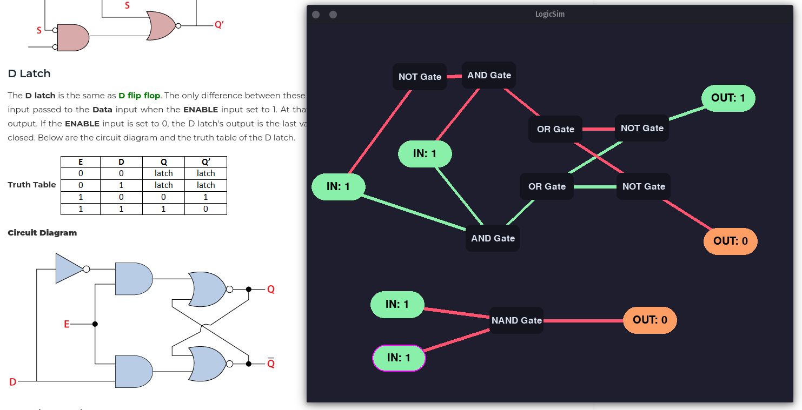

# LogicSim


Logic Gate simulator 0.1v BETA


## Installation

Make sure python3 and pip3 + pygame is installed on your system

```bash
  git clone git@github.com:CyberBeast1/logicSim.git
  cd logicSim/
  python src/main.py
```
    
## Tutorial
Keyboard inputs
- `i` : add input node
- `o` : add output node
- `z` : change gate selection
Mouse:

- `left` : adds logic gate from selection
- `middle` : used to add connections
    - for connecting gates with inputs/outputs, **First select gate with middle click and then input/output node**
    - for gate to gate connections, eg, `A`->`B` (**output** of `A` is going into `B`)
        - First select `A` then `B`.
- `right` : Deletes node
